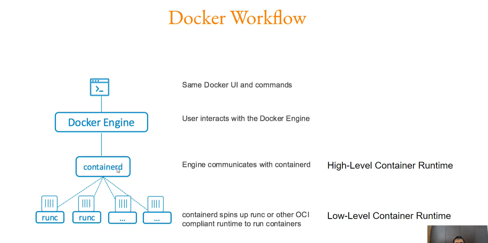
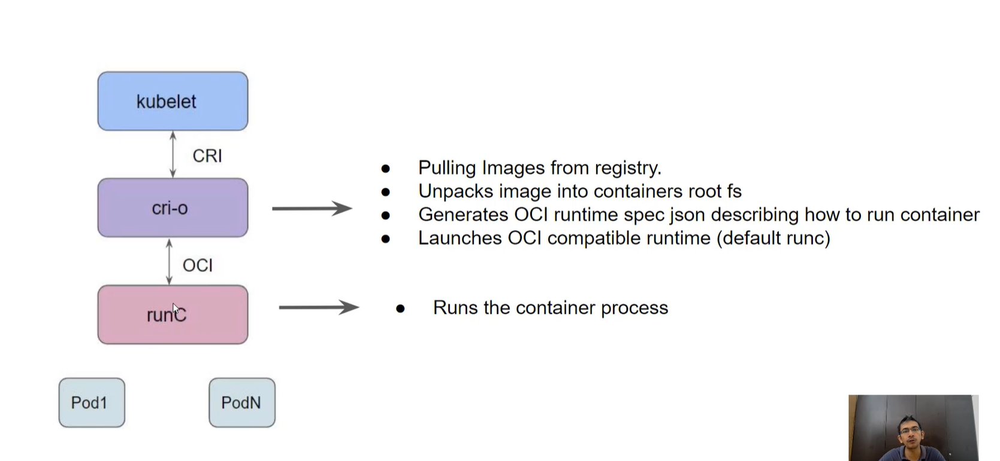

# Kubernetes Security
**kube-bench** allows us to scan our K8s cluster based on the CIS (Center for Internet Security) Benchmark guidelines

Providers secure the control plane. 

## etcd
- Plain text
- Transport Security with Https
- Authentication with Https certificates 
  

## kubelet
Allow Anonymous should be false, Authentication should be Webhook in config.yaml

## Role Based Access Control
A user with appropriate role should be created to access k8s cluster

## Admission Controllers

Runs after Authentication and Authorization

Validating: Ex: Ensure PODS are not created with privileged mode. Reject otherwise (PodSecurityPolicy)

Mutating: Ex: Change API objects to add/remove capabilities. nodeSelector: env=prod (PodNodeSelector)

- AlwaysPullImages
- LimitRanger
- NamespaceExists
- EventRateLimit
- etc.

Path: /etc/kubernetes/manifests/kube-apiserver.yaml

## Privileged Containers
By default, docker container does not have many capabilities assigned to it.
- Docker containers are also not allowed to access any devices.
Hence, by default, docker container cannot perform various use-cases like run docker container inside a docker container

Privileged Container can access all the devices on the host as well as have configuration in AppArmor or SELinux to allow the container nearly all the same access to the host as process running outside containers on the host.
- Limits that you set for privileged containers will not be followed
- Running a privileged flag gives all the capabilities to the container

## ImagePullPolicy
- Always
- IfNotPresent
- Never

A developer may try to use an image with a secret. To prevent it we should set an admission controller to force Always. 

## ImagePolicyWebhook
Allows a backend webhook to make admission decisions. (Ex: External Image Validator, kube-image-bouncer)

## AppArmor
AppArmor profiles are specified per-container

To specify the AppArmor profile to run a Pod container with, add an annotation to the Pod's metadata

## Docker Flow

## High Level and Low Level Runtimes

## Container Runtimes
A container runtime is software that executes containers and manages images on a node

There are multiple container runtimes available. Some of these include:
- Docker
- containerd
- Cri-o
- Podman

## Container Runtime Sandboxes
Reduces the number of system calls available. Generally organization makes use of sandboxes like **gVisor** for the applications that are not trusted (cloning repo from GitHub and running the application)

It can lead to certain performance degradation.

### RunTimeClass
It is a feature for selecting the container runtime configuration.

You can set a different RuntimeClass between different Pods to provide a balance of performance versus security

## Network Policy
Use ingress and egress type to configure network security.

## Image Scanners
- Anchore
- Docker Trusted Registry
- Tenable
- Trivy

Amazon ECR has its own image scanner

## Static Analysis
There are tools like **Checkov** that can perform static analysis.
Check manifest yamls and dockerfiles.

## Falco
It is an open-source based security tool which allows user to define a set of rules that will trigger an alert whenever the conditions are met

Sample Rules:
- A shell inside a container
- Sensitive file like /etc/shadow is read
- curl /wget command used
- New package installed

## Sysdig

To get details of system calls, network traffic monitoring, process monitoring, network connection monitoring etc.

    sysdig proc.name=cat and container.id!=host

## Audit Logs
K8s audit logs can be saved by creating new audit manifests.